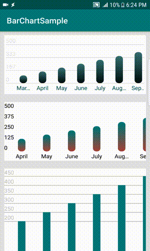

# BarChartView
[  ](https://bintray.com/ma7madfawzy/BarChart/com.widget.barchart/_latestVersion)

An Android library that lets you create a BarChartView in a simple flexible and easy way .

r

## Quick Setup

### 1- Include library

#### Using Gradle
```
dependencies {
implementation  'com.widget:barchart:2+'
}
```
#### Using Maven
```
<dependency>
  <groupId>com.widget</groupId>
  <artifactId>barchart</artifactId>
  <version>2+</version>
  <type>pom</type>
</dependency>

```
## 2- Usage

### 2.1 XML Layout:

 ```
 <com.widget.chart.BarChartView
    android:id="@+id/chartView"
    android:layout_width="match_parent"
    android:layout_height="150dp"
    android:layout_margin="10dp"
    <!--defines chart column background drawable-->
    app:column_background="@drawable/bg_gradient_primary"
     <!--or set chart column background color-->
    app:column_color="@color/colorAccent"
     <!--defines column label text color-->
    app:column_label_color="@color/colorPrimaryDark"
    <!--defines Space between columns-->
    app:gap="5dp"
     <!--shows x-coordinates-->
    app:showLines="true"
     <!--shows x-coordinates values-->
    app:showPercentages="true"
    <!--shows x-coordinates color (label and line)-->
    app:x_line_color="@color/grey_300"/>

```
### 2.2 Dynamically:

#### BarChartModel constructors takes label and the percent needed
````
 public BarChartModel(String label, int percent) {
        this.label = label;
        this.percent = percent;
    }

    public BarChartModel(int percent) {
        this.percent = percent;
    }
````

##### Invoke drawChart wich can deal with different params:
````
List<BarChartModel> columnsModelList = new ArrayList<>();
    for (int i = 2; i <= 10; i++) {
          columnsModelList.add(new BarChartModel("Label: "+i, i * 50));
          rowsModelList.add(new BarChartModel("" + i * 50, i * 50));
        }
````
###### With clumnModelList and required x-coordinates number:
````
chartView.drawChart(columnsModelList, 4);// 4 is the required x-coordinates number which will be drawn with equaled                gap.
````
###### With clumnModelList and rowsModelList:
````
List<BarChartModel> rowsModelList = new ArrayList<>();
chartView.drawChart(columnsModelList, rowsModelList);// rowsModelList of type rowsModelList represents 
````
###### With clumnModelList only:
````
   chartView.drawChart(columnsModelList);// it's like with 0 x-coordinates number .
````
## 3- Customize
### Feel free to override any of these dimensions:
````
    <!-- defines the width of label of horizontal rows -->
    <dimen name="row_label_width">@dimen/_20sdp</dimen>
    <!-- defines the width of label of columns -->
    <dimen name="column_label_width">@dimen/_30sdp</dimen>
    <!-- defines the height of label of horizontal rows  -->
    <dimen name="row_label_height">@dimen/_20sdp</dimen>
    <!-- defines the height of of horizontal rows  -->
    <dimen name="row_line_height">2dp</dimen>
    <!-- defines the text size of both column and row labels -->
    <dimen name="barTitle">@dimen/_12ssp</dimen>
    <!-- defines width of the column (chart) -->
    <dimen name="column_width">@dimen/_15sdp</dimen>
````
### Happy Coding

## Authors

* [Mohammed Fawzy](https://github.com/ma7madfawzy)
* [Ali Gamal](https://github.com/aligamal-dev)
* [Muhammad Noamany](https://github.com/muhammadnomany25)


## License

This project is licensed under the MIT License - see the [LICENSE.md](LICENSE.md) file for details

